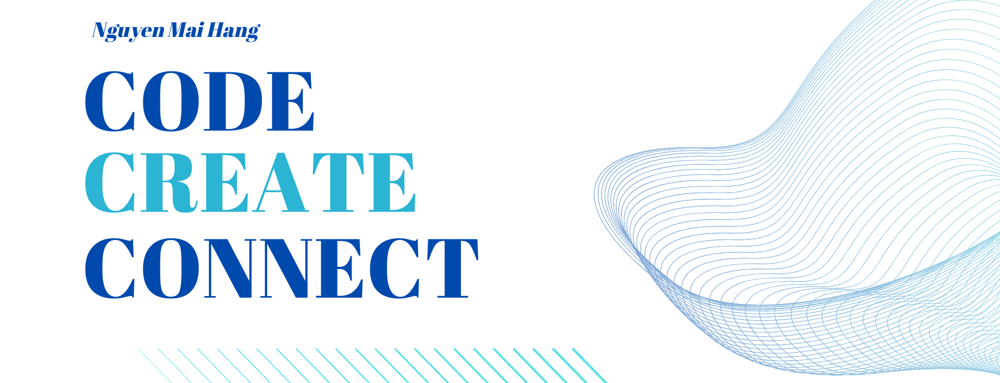

 
# 👋 Hi, I'm Mai Hang

### 🎓 Multimedia Technology Student at PTIT

I am a student specializing in **Multimedia Technology** at the **Posts and Telecommunications Institute of Technology (PTIT)**. I'm passionate about blending **technology** with **creativity** to produce engaging digital media and user experiences.

---

### 🚀 Skills & Interests

| Category | Tools / Focus Areas |
| :--- | :--- |
| **Design & Graphics** | **Adobe Photoshop**, **Adobe Illustrator**, **Figma**, **UI/UX Fundamentals** |
| **Programming** | **HTML/CSS**, **JavaScript** (Basics), **Python** (Basics) |
| **Media Production** | **Adobe Premiere Pro**, **Adobe After Effects**, **Video Editing**, **Storyboarding** |
| **Learning** |  ReactJS, 3D Modeling, etc. |

---

### 💡 Goals & Collaboration

I'm currently focused on:

* Developing personal projects that combine **front-end development** and **creative design**.
* Seeking opportunities to collaborate on **UI/UX design** and **digital content creation** projects.
* Expanding my knowledge in **web accessibility / data visualization**.

---

### 🌐 Connect with Me

* **Email**: [n23dcpt078@student.ptithcm.edu.vn]
* **Portfolio/Website**: [Portfolio Link (if any)]

---

### 🔥 My GitHub Activity

